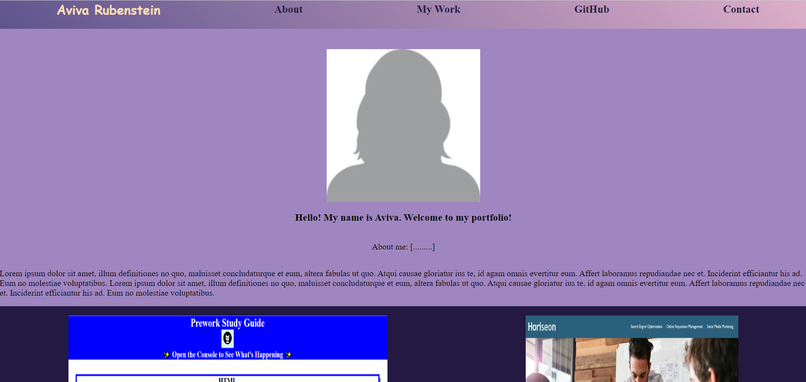

# <Portfolio Site>

## Description

This project is a portfolio website for projects that I have developed.  It is meant to be updated with more projects as I progress in my learning, and to be a representation to employers of the skills I have learned.


## Installation

To open the site, visit: 
## Usage

    ```md
    
    ```

## Credits


## License

See LICENSE.txt file in repository.
